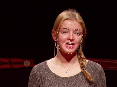

# cnn-facial-landmark

Facial landmarks detection based on convolution neural network.

Here is a sample gif showing the detection result.




The model is build with TensorFlow, and training code is provided so you can train your own model with your own datasets. The companion tutorial is also [available](https://yinguobing.com/facial-landmark-localization-by-deep-learning-background/), which includes background, dataset, preprocessing, model architecture, training and deployment. I tried my best to make them simple and easy to understand for beginners. Feel free to open issues when you are stuck or have some wonderful ideas to share.


## Getting Started

These instructions will get you a copy of the project up and running on your local machine for development and testing purposes.

### Prerequisites


### Installing

Just git clone this repo and you are good to go.

```bash
# From your favorite development directory
git clone https://github.com/yinguobing/cnn-facial-landmark.git
```

## Train & evaluate

The following command shows how to train the model for 10 epochs.

```bash
# From the repo's root directory
python3 landmark.py \
    --train_record=train.record \
    --val_record=validation.record \
    --batch_size=32 \
    --epochs=10
```
Training and testing files are required to be stored as TensorFlow Record files. You can generate them by yourself, or checkout the branch `features/tfrecord-marks-68` in this repository: [face-mesh-generator](https://github.com/yinguobing/face-mesh-generator).

```bash
git clone https://github.com/yinguobing/face-mesh-generator.git
git checkout features/tfrecord-marks-68
```

## Export

### For PC/Cloud applications

TensorFlow's [SavedModel](https://www.tensorflow.org/guide/saved_model) is recommended and is the default option. Use the argument `--export_only` to save the model.

```bash
# From the repo's root directory
python3 landmark.py --export_only=True
```

### For Mobile/Embedded/IoT devices

These devices tend to have constrained resource and TensorFlow Lite is most suitable for this situation. However this is beyond the scope of this project. But don't worry, you will find a more comprehensive project in the next section.

## Where to go next?

Once you have accomplished all the applications above, it's a good time to move on to a more advanced repo with following features:

- Support multiple public dataset: WFLW, IBUG, etc.
- Advanced model architecture: HRNet v2
- Data augmentation: randomly scale/rotate/flip
- Model optimization: quantization, pruning

Watch this demo video: [HRNet Facial Landmark Detection (bilibili)](https://www.bilibili.com/video/BV1Vy4y1C79p/)

And build a better one: https://github.com/yinguobing/facial-landmark-detection-hrnet


## Authors

Yin Guobing (尹国冰) - [yinguobing](https://github.com/yinguobing/)


## License


## Acknowledgments

* The TensorFlow team for their comprehensive tutorial.
* The iBUG team for their public dataset.

## Changelog

### Update 2021-03-09
A preprocessing layer was added and new model weights provided.

### Update 2020-06-20
Making `Keras` the default way of building models.

### Update 2019-08-08
A new input function is added to export the model to take raw tensor input. Use the `--raw_input` argument in the exporting command. This is useful if you want to "freeze" the model later.

For those who are interested in inference with frozen model on image/video/webcam, there is a lightweight module here:https://github.com/yinguobing/butterfly, check it out.


### Update 2019-06-24
Good news! The code is updated. Issue #11 #13 #38 #45 and many others have been resolved. No more `key error x` in training, and exporting model looks fine now.

### Update 2019-05-22
Thanks for your patience. I have managed to updated the repo that is used to extract face annotations and generate TFRecord file. Some bugs have been fixed and some minimal sample files have been added. Check it out [here](https://github.com/yinguobing/image_utility) and [here](https://github.com/yinguobing/tfrecord_utility).

The training part(this repo) is about to be updated. I'm working on it.

### Update 2019-04-22
This repository now has 199 github stars that is totally beyond my expectation. Whoever you are, wherever you are from and whichever language you speak, I want to say "Thank you!" to you 199 github friends for your interest.

Human facial landmark detection is easy to get hands on but also hard enough to demonstrates the power of deep neural networks, that is the reason I chose for my learning project. Even I had tried my best to keep a exhaustive record that turned into this repository and the companion tutorial, they are still sloppy and confusing in some parts.

The code is published a year ago and during this time a lot things have changed. TensorFlow 2.0 is coming and the exported model seems not working in the latest release of tf1.13. I think it's better to make this project up to date and keep being beneficial to the community.

I've got a full time job which costs nearly 12 hours(including traffic time) in my daily life, but I will try my best to keep the pace.

Feel free to open issues so that we can discuss in detail.
